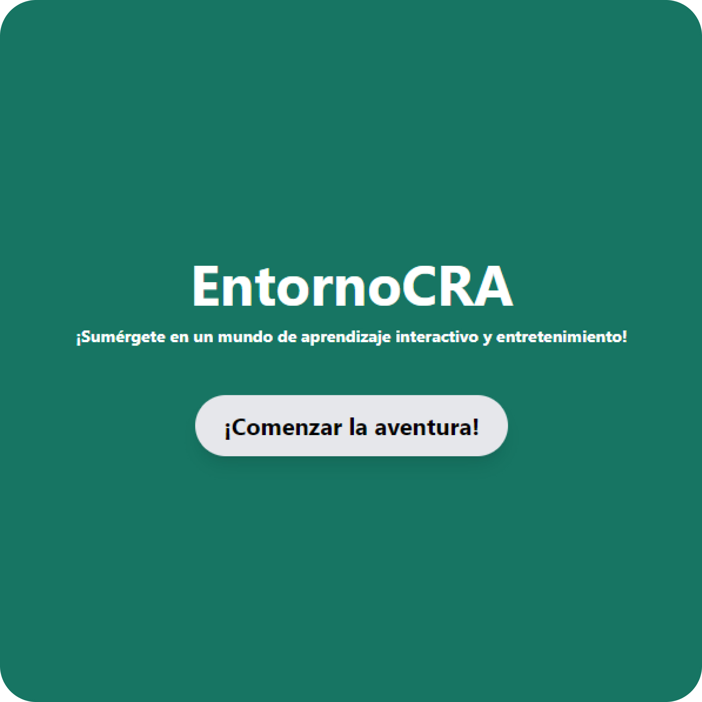
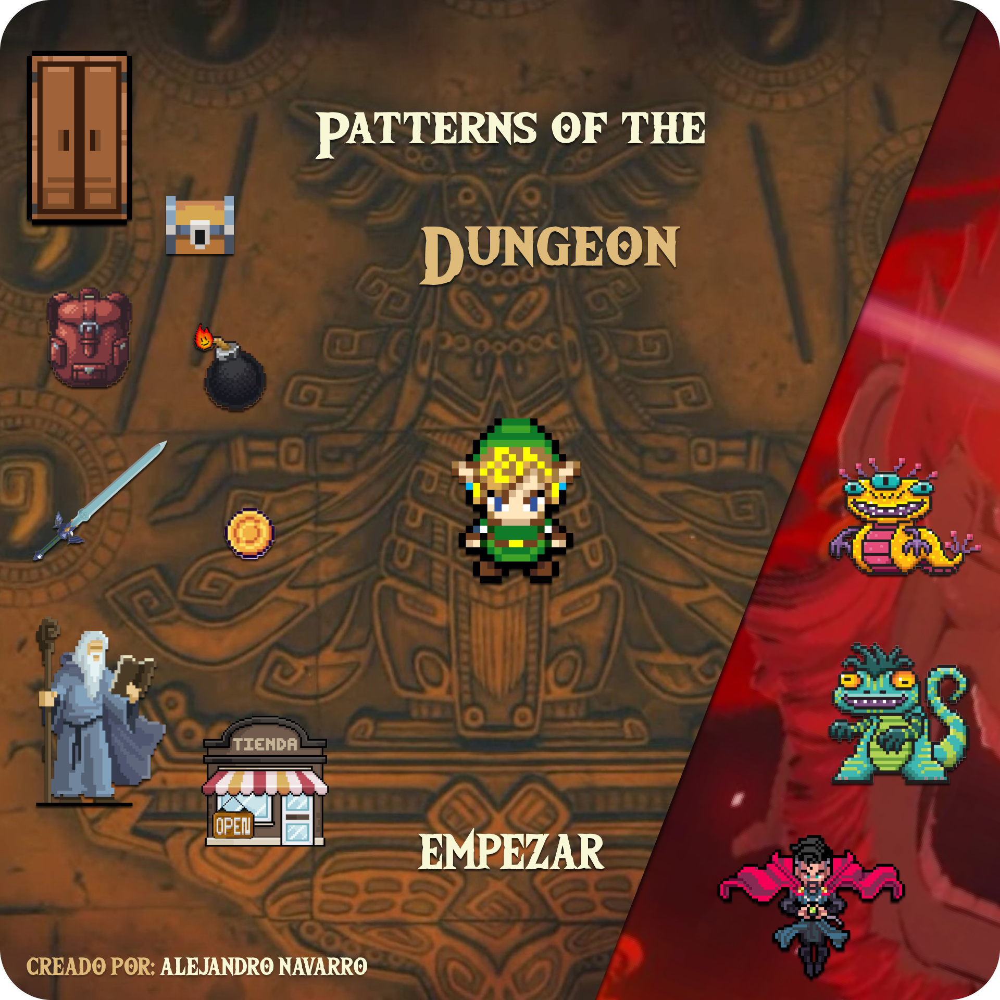

    

#### Profesional en constante crecimiento y formación, comprometido con la entrega de resultados de calidad.

## Proyectos Destacados 🚀

<table style="width: 100%;">
  <tr>
    <td style="width: 33.33%; text-align: center;">
      
       
      <a href="https://entornotfg-h47w4qe3wq-no.a.run.app/"><b>EntornoCRA</b></a>
       
      
Mundo virtual tridimensional interactivo aplicado a la educación.

    </td>
    <td style="width: 33.33%; text-align: center;">
      
       
      <a href="https://github.com/alenavarroxp/PatternsOfTheDungeon"><b>Patterns Of The Dungeon</b></a>
       
      
Videojuego de mazmorras aplicando patrones de diseño.

    </td>
    <td style="width: 33.33%; text-align: center;">
      
       
      <a href="https://github.com/dongnez/PagameWeb"><b>PAGAME</b></a>
       
      
Aplicación para repartir gastos entre grupos de personas.

    </td>
  </tr>
</table>

## Contacto 📫
 

